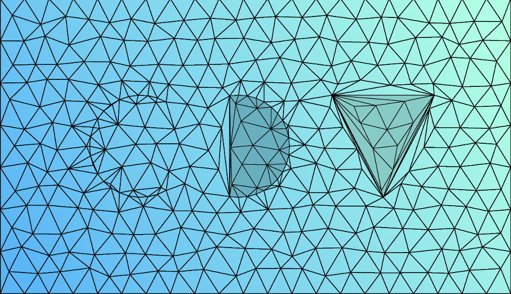

**CDT-JS** is an interactive web app for generating constrained Delaunay triangulations of 2D points, written in JavaScript.

### Check out the [**app here**](https://savithru-j.github.io/cdt-js/mesher.html).

### How to use

1. Insert a set of 2D points to triangulate.
  * **Random:** A random distribution of points may be added by entering the required number of points and clicking the *"Generate random vertices"* button. The points can be sampled from a uniform or standard normal distribution.
  * **Import from file:** Points may also be imported from a file using the button under *"Load vertices from file"*. The x and y coordinates of each point should be space- or comma-separated, and each point should exist on its own line.
  * **Manual entry:** Directly add or modify points using the text-box under *"Vertex list"*, and click the *"Reload input data"* button.

2. Specify the set of edges to constrain, if any.
  * **Random:** Click the *"Generate random edge constraints"* button to randomly generate the specified number of edge constraints.
  * **Import from file:** Edge constraints can also be imported from a file using the button under *"Load constrained edges from file"*. Each edge should be specified by the indices to its two end-points in the vertex list. The vertex indices use 0-based indexing, and should be space- or comma-separated.
  * **Manual entry:** Directly add or modify edge constraints using the text-box under *"Constrained edge list"*, and click the *"Reload input data"* button.

3. Click the *"Triangulate!"* button to generate the constrained Delaunay triangulation.

4. Explore!
  * Click on the visualization to see more information about the points and triangles.
  * Locate and visualize a particular point or triangle by its index.
  * The indices to the three vertices of each triangle are printed in the last text-box of the control panel.

### Performance

Some benchmark results obtained on an Intel Core i7-4712HQ (2.3 GHz), running Google Chrome v70.0 (JavaScript V8).

| | N = 100 | N = 1000 | N = 10,000 | N = 100,000 |
|:-- | --: | --: | --: | --: |
| Random points - uniform distribution, no edge constraints | 1ms | 5ms | 41ms | 570ms |
| Random points - normal distribution, no edge constraints | 1ms | 5ms | 52ms | 837ms |
| Random points - uniform distribution, 0.01N edge constraints | 2ms | 5ms | 65ms | 1.6s |
| Random points - uniform distribution, 0.1N edge constraints | 2ms | 8ms | 232ms | 26.5s |

### References

The algorithms implemented here are based on the following papers:

* [A fast algorithm for generating constrained Delaunay triangulations](https://www.sciencedirect.com/science/article/pii/004579499390239A), S.W. Sloan, Computers & Structures, 1993.
* [A robust efficient algorithm for
point location in triangulations](https://www.cl.cam.ac.uk/techreports/UCAM-CL-TR-728.pdf), P.J.C. Brown and C.T. Faigle, Technical Report, University of Cambridge, 1997.
